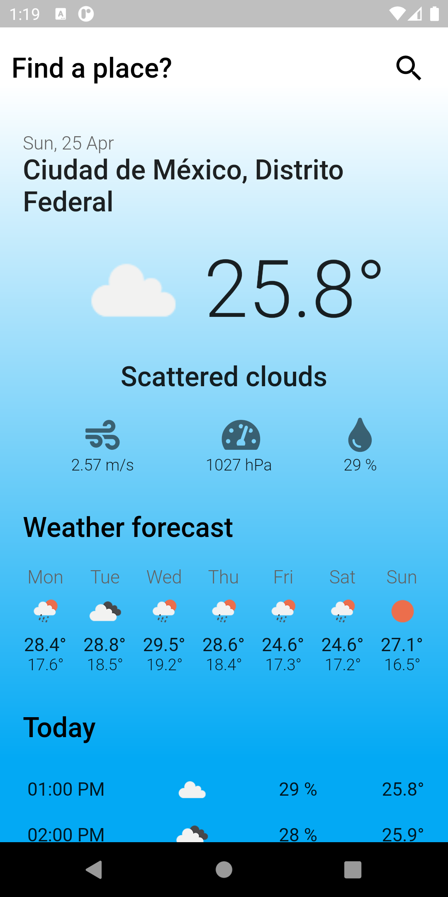
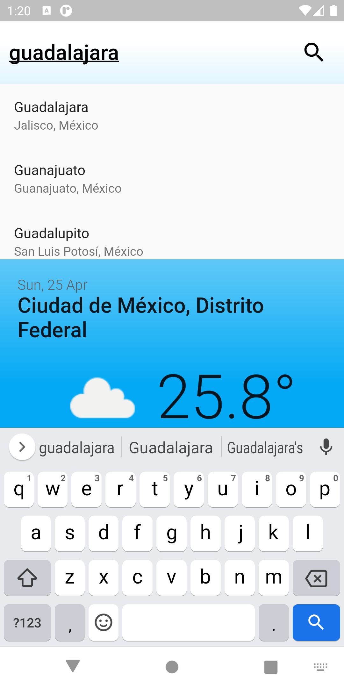
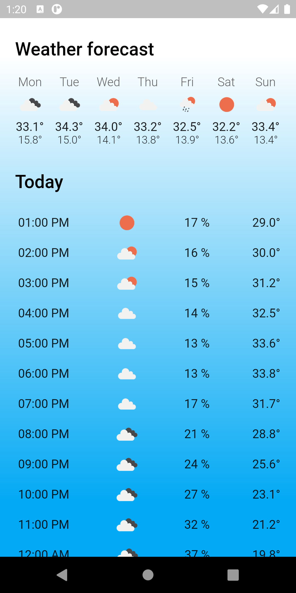
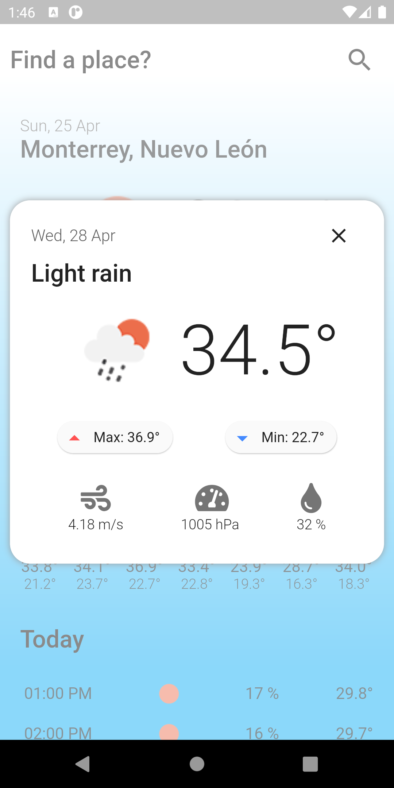

# Weather app for travels

If you will travel, you can find cities in USA and MX for know the current weather and 7 days forecast, please grant permission for get location data and view your current weather in your actual location.

# Flutter App

App was developed using a bloc pattern architecture, mixins, extensions, and more.

## Flutter Setup

Please use next environment:

```
    [✓] Flutter (Channel stable, 1.22.6, on macOS 11.2.3 20D91 darwin-x64, locale en-MX)
    [✓] Android toolchain - develop for Android devices (Android SDK version 30.0.3)
    [✓] Xcode - develop for iOS and macOS (Xcode 12.4)
    [✓] Android Studio (version 4.1)
    [✓] VS Code (version 1.55.2)
    [✓] Connected device (1 available)
```

- Your can download flutter SDK here: https://storage.googleapis.com/flutter_infra/releases/stable/windows/flutter_windows_1.22.6-stable.zip
- Setup your environment using this instructions: https://flutter.dev/docs/get-started/install

## Run Android app

- Download dependency packages using `flutter pub get` command
- Open a **simulator** o connect a **physical device**.
- Run flutter project using `flutter run`
- For iOS project some times is necessary install pods using `cd ios && pod install` command.

## Screenshots

   

## App in Action


